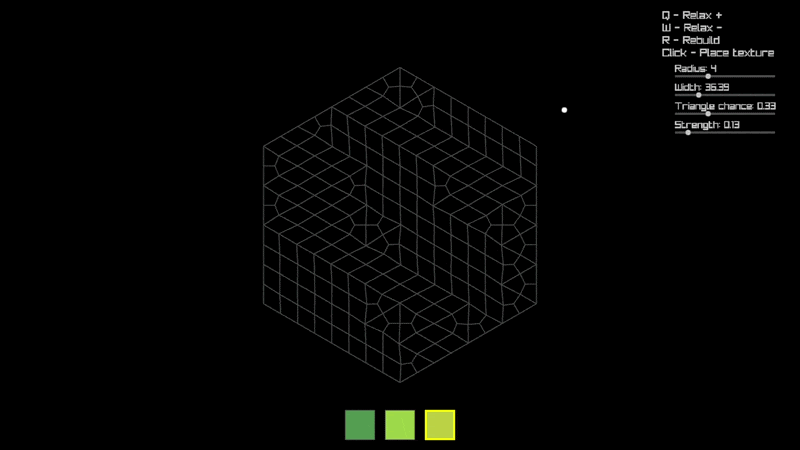

# Organic Grid

A small C++/raylib experiment that generates an irregular, quadrilateral, 2D grid.

This project is an attempt to understand and reproduce, from
scratch, the pieces behind Oskar Stålberg's *Townscaper* (grid generation,
relaxation, and simple tile placement), not a copy of its code or assets.

## Requirements
- [Visual Studio 2022](https://visualstudio.com) (Not strictly required, but the included setup scripts support this version)
- [Clang](https://clang.llvm.org/) (Linux)
- [Git](https://git-scm.com)

## Getting Started
1. **Setup**
   Navigate to the `/Setup` directory and run the appropriate setup file for your operating system.
   - **Note:** The setup process will execute the Premake executable. If you want to avoid this, download Premake v5.0.0-beta2 (or latest) yourself from the [official release page](https://github.com/premake/premake-core/releases/tag/v5.0.0-beta2).
   - **Note:** The Linux setup has not been thoroughly tested.
2. **Dependencies**
   All dependencies (raylib) will be automatically downloaded and configured (hopefully).
3. **Windows**
   - A VS2022 solution will be created in the root directory.
   - Open the solution, build, and run to execute the project.
4. **Linux**
   - A Makefile will be generated.
   - Build using: `make`
   - Executable is generated here: `Binaries/<platform>/Dev/OrganicGrid`

## License
- The repository itself is licensed under the terms described in `LICENSE`.
- Premake is licensed under the BSD 3-Clause license (see `Premake/LICENSE.txt` for details).
- raylib is licensed under the zlib/libpng license (see `Dependencies/Raylib/LICENSE` for details).

**Note:** raylib is included as dependency and licenses are provided in the Dependencies folder. Ensure you comply with their respective license terms when distributing or using this software.
